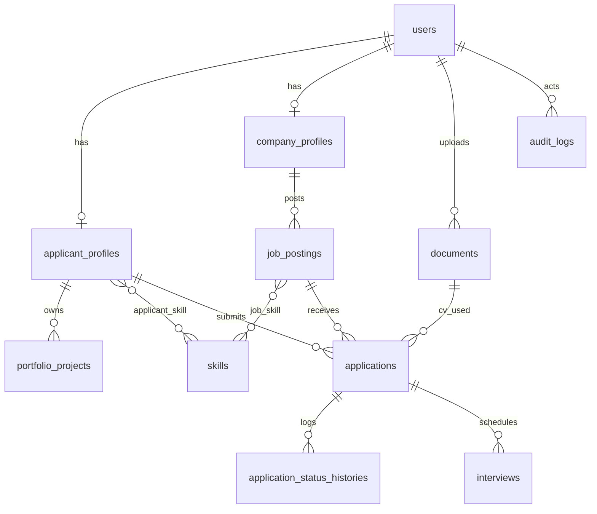

# ERD KarirTI

```mermaid
erDiagram
    users ||--o| applicant_profiles : has
    users ||--o| company_profiles : has
    users ||--o{ documents : uploads
    users ||--o{ audit_logs : acts
    applicant_profiles ||--o{ portfolio_projects : owns
    applicant_profiles }o--o{ skills : applicant_skill
    company_profiles ||--o{ job_postings : posts
    job_postings }o--o{ skills : job_skill
    job_postings ||--o{ applications : receives
    applicant_profiles ||--o{ applications : submits
    documents ||--o{ applications : cv_used
    applications ||--o{ application_status_histories : logs
    applications ||--o{ interviews : schedules
```

Lihat `plan.md` Bagian 7 untuk detail kolom setiap tabel.
